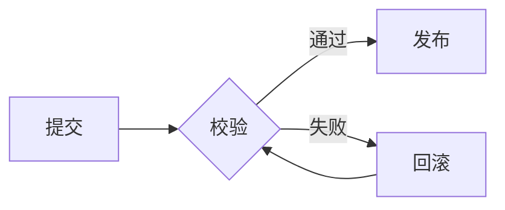

# 发布流水线

发布要经过校验。失败时回到校验，而不是直接上线。

```mermaid
flowchart LR
  A[提交] --> B{校验}
  B -->|通过| C[发布]
  B -->|失败| D[回滚]
  D --> B
```

收集材料之后整理，再展示。三步只有一个方向。

```mermaid
flowchart LR
  A[收集] --> B[整理] --> C[展示]
```

有人把回滚比喻成电锯切西瓜。这句不要画成工具。

同步发布让读者立刻看到结果。排队发布则把结果交给后台。两边都要能对照。

一次改动把接口延迟从 12ms 降到 9ms。文中没有数据表。

