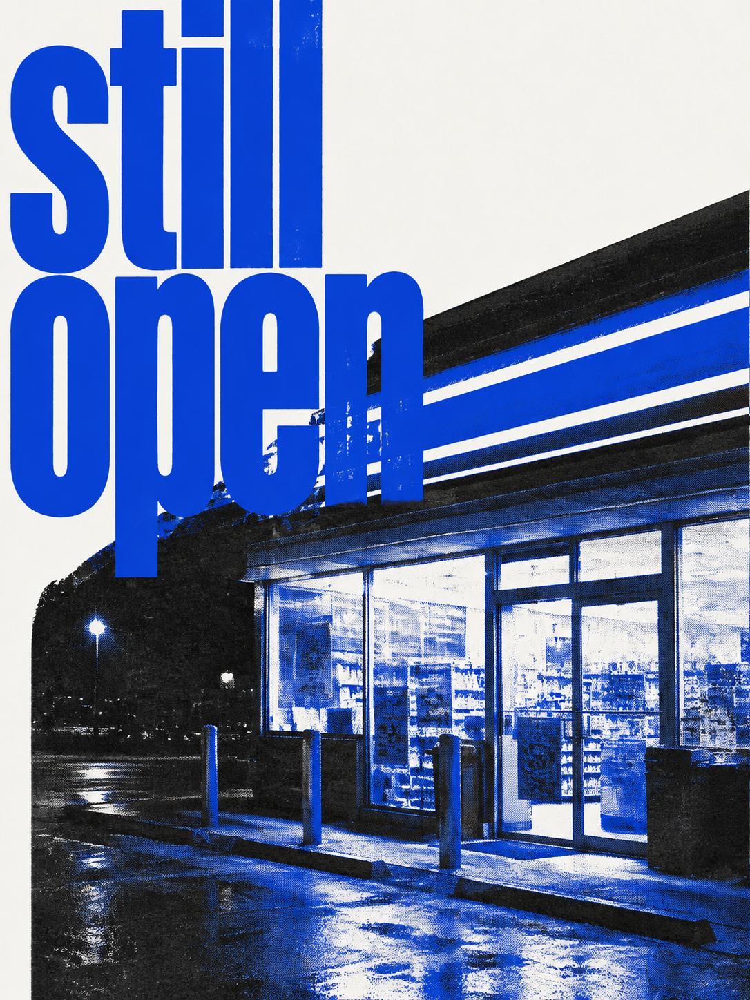
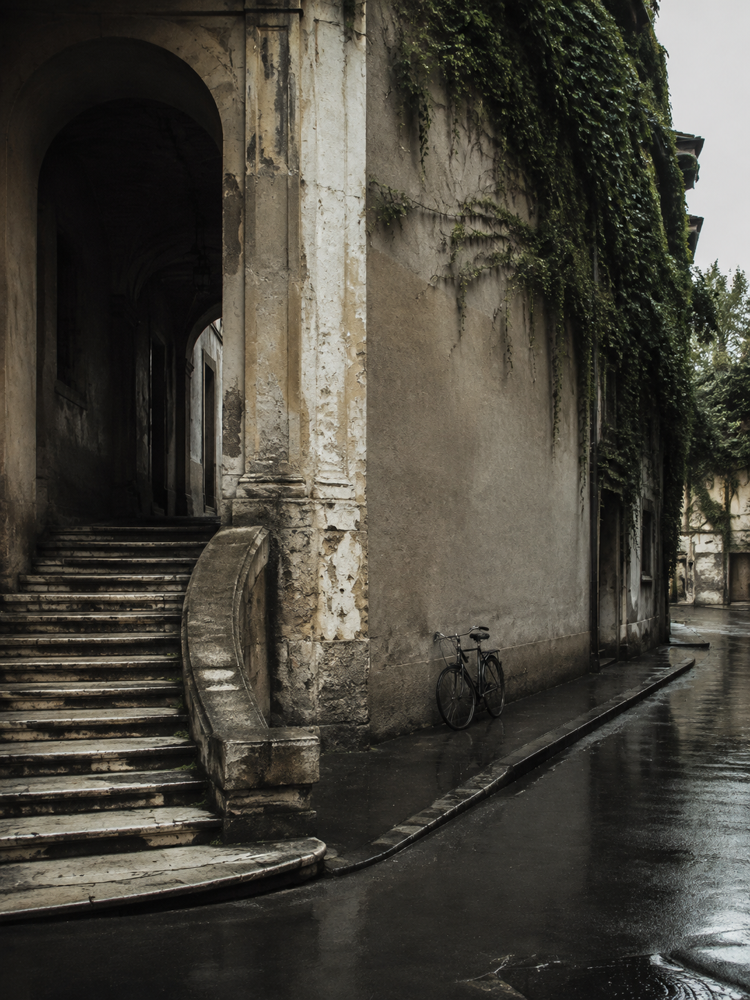

# 平面制作示例

以下示例使用独立虚构内容，分别展示排版优先、生图优先与混合路线。它们说明判断过程，不是三套固定模板。两张示例图均为本插件示例独立生成，没有使用第三方图片；完成作品时仍需保留用户给定文字，不添加似真的发行、品牌或活动信息。

## 排版优先：抽象《城市切片》

**请求**：为虚构刊物做一张竖版数字封面，3:4。文字只有“城市切片”“沿着日常路线，重新发现城市。”“VOL. 01”。用抽象城市形态，不需要真实照片。

**Seed**：`mC1nkP2t`。借颜色职责、字图张力与安静区域，本次明确采用双色编辑印刷方向。

**为什么采用排版优先**：主体本来就是抽象街道、窗和阶梯，视觉质量来自精确的中文字形、尺度关系和几何节奏。生成复杂摄影材质不会增加表达，反而会降低三段文字的可控性。

**制作**：Cobalt 承担抽象城市主体和大标题，Terracotta 集中在少量转折形态与期号。主标题占据上方，较轻的说明安放在安静区域。使用自定义 SVG 与文字排版完成 1080 × 1440 封面；坐标属于这张作品，不限制其他任务。

[查看《城市切片》排版优先完整源文件](examples/city-slices.html)

**查看与交付**：在实际封面和缩略图中核对三段文字，检查主形态、颜色职责与阅读层级。交付导出图片与可编辑源文件。

**容易做错**：把双色理解成给全彩照片加滤镜；把参考的纸面比例和坐标机械照搬；因为前一个示例使用 SVG，便把带摄影或有机材质的任务也画成规整矢量。

## 生图优先：`still open`

**请求**：为虚构的午夜便利店场景制作 3:4 竖版编辑海报。画面只出现英文 `still open`，不出现品牌、地点、日期、网址或其他文字。使用 Neutral White `#FAFAF7` 纸面、Electric Blue `#173AE3` 与 Carbon `#242321` 两种墨色。

**Seed**：`mC1nkP2t`。借单一强焦点、字图碰撞、有限墨色、机械网点与较安静的留白，不沿用已有布局。

**为什么采用生图优先**：夜间灯光、湿地反射、店面裁切、油墨颗粒和标题压入建筑的关系共同承担感染力。把它们还原为规整 SVG 会丢失本例最重要的摄影与印刷质感；文字只有两个短词，可以在生成后逐字核对。

**制作提示词**：

> 制作一张完成态的 3:4 竖版编辑海报，正面平视，只呈现海报本身。主题是午夜仍亮着灯的虚构便利店：店面从右下方被大胆裁入，湿润路面保留反光，建筑与超大标题形成明显遮挡和穿插。准确显示两行英文“still open”，不增加其他文字、品牌、标志、地点、日期、网址、二维码或商品标签。采用 Neutral White #FAFAF7 纸面，Electric Blue #173AE3 与 Carbon #242321 两种墨色；呈现机械网点、油墨覆盖差异和克制的套印质感。保留一块安静纸面，让焦点集中在标题与夜间店面碰撞处。避免卡片拼贴、光滑渐变、居中模板、桌面摆拍和相框。

**查看与交付**：逐字确认 `still open`，检查没有生成似真的品牌或地点信息，并在缩略图确认店面仍可辨认。交付最终图片并保留实际提示词；若后续要反复换标题，再改用独立排版层。

**容易做错**：只把蓝黑配色套在普通矢量店铺上；为了证明使用了 seed 而加满网格和编号；看到准确文字要求就放弃图像质感。

## 混合：纪实《城市切片》

**请求**：仍使用“城市切片”“沿着日常路线，重新发现城市。”“VOL. 01”，但将抽象封面改为雨后城市观察方向。画面不指向真实城市，也不添加其他信息。

**Seed**：`Yoiov5EL`。借纪实观察、建筑局部、路径感和严谨的编辑层级；舍弃编号节点与解释线路，因为它们会让这张封面变成导览图。

**为什么采用混合路线**：旧墙、常春藤、雨水与自行车需要可信的摄影细节，三段中文则必须准确且能继续编辑。无字图像负责场景质感，SVG 文字层负责信息与版面，两部分缺一都会降低成品质量。

**无字主视觉提示词**：

> 生成一张原创、无文字的竖版纪实城市照片：雨后的虚构旧城通道，一侧是有岁月痕迹的拱门与台阶，墙面有克制的常春藤，一辆普通自行车停在转角，湿润路面形成自然反光。空间安静，适合编辑刊物封面裁切；不出现人物、品牌、路牌、地名、著名地标、车辆号牌、海报或任何可读文字。自然阴天光线，真实材料细节，不使用复古滤镜或戏剧化旅游明信片效果。

[查看《城市切片》混合路线完整源文件](examples/city-slices-photo.html)

**制作与查看**：将主视觉作为可替换图像层，按照片的拱门、台阶和道路留出标题区，再用独立 SVG 层准确排入三段文字。核对图像不暗示具体地点，逐字检查中文，并确认照片与文字在 1080 × 1440 和缩略图中都形成同一阅读节奏。

**容易做错**：让模型直接生成全部中文后不核对；给虚构场景补上真实地名或路线；机械保留 seed 的所有编号和注释，压过刊物标题。

## 不采用印刷语言时

虚构单曲“潮间带”的方形数字封面只保留这个标题，并要求流动的全彩形态与空间感。此时可借 seed 的尺度对比与阅读节奏，但纸面、双色限制与网点都不服务内容，应当舍弃。根据流动形态是否依赖有机细节选择生图或可控图形工具，再在缩略图检查标题与主体；不能因为上面的示例采用 mono-color，继续输出蓝橙双色纸面。
